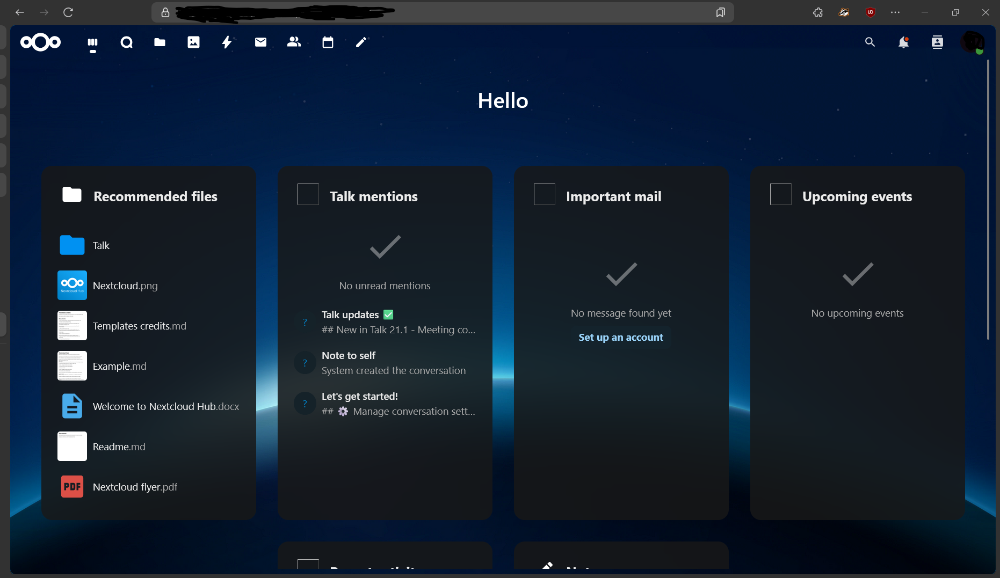

# Nextcloud on WSL2 using Tailscale and Caddy

A self-hosted, private cloud storage solution running Nextcloud in Docker on Windows using WSL2, securely exposed with Tailscale and TLS via Caddy.



---

##  Features

- Fully local Nextcloud instance (via Docker in WSL2)
- Secure remote access with **Tailscale** + **MagicDNS**
- HTTPS with **TLS certificates** auto-managed by Tailscale
- Reverse proxy via **Caddy**, configured for TLS passthrough
- External drive mounting for persistent Nextcloud storage

---

##  Tech Stack

- **Nextcloud** (via Docker)
- **MariaDB** (Nextcloud backend)
- **WSL2** (Ubuntu running on Windows)
- **Docker Desktop for Windows**
- **Tailscale** with MagicDNS
- **Caddy web server** for reverse proxy + TLS

---

##  Setup Overview

### 1. Clone this repository

```bash
git clone https://github.com/Sencrzz29/Nextcloud-on-WSL2-using-Tailscale-and-Caddy.git
cd Nextcloud-on-WSL2-using-Tailscale-and-Caddy
```

---

### 2. Bring up Docker containers

```bash
sudo docker compose up -d
```

This starts:

    nextcloud-app (web frontend)

    nextcloud-db (MariaDB backend)


Default ports:

    Nextcloud: localhost:8080

    MariaDB: internal-only (3306)

---

### 3. Connect to Tailscale

Install and login:

```bash
sudo apt install tailscale
sudo tailscale up
```

Ensure MagicDNS is enabled in the Tailscale admin panel. This gives you a .ts.net domain (e.g., yourmachine.ts.net).

---

### 4. Configure Caddy for HTTPS reverse proxy

Update your /etc/caddy/Caddyfile:

```caddy
https://<your-magicdns-name>.ts.net {
    tls /var/lib/tailscale/certs/<your-magicdns-name>.ts.net.crt /var/lib/tailscale/certs/<your-magicdns-name>.ts.net.key

    reverse_proxy localhost:8080
}
```

Set file permissions so Caddy can read the TLS certs:

```bash
sudo setfacl -m u:caddy:rx /var/lib/tailscale/certs
sudo setfacl -m u:caddy:r /var/lib/tailscale/certs/*
```

Then start Caddy:

```bash
sudo systemctl restart caddy
```

---

### 5. Add domain to Nextcloud's trusted_domains

Inside the Nextcloud container:

```bash
sudo docker exec -it nextcloud-app bash

nano /var/www/html/config/config.php
```

Update the 'trusted_domains' block:

```php
'trusted_domains' => 
  array (
    0 => '<your-magicdns-name>.ts.net',
    1 => 'localhost',
  ),
```

Save and exit.

Access from any device on your Tailscale network, open:

https://<your-magicdns-name>.ts.net

## Notes

    Caddy must run with permissions to access /var/lib/tailscale/certs.

    App passwords / QR logins are not included — standard web auth is used.

    Screenshot has been sanitized to avoid leaking private info.

## File Structure


    ├── docker-compose.yml
    ├── Caddyfile
    ├── Screenshot 2025-07-19 031959-1.png
    └── README.md

## TODO

    Optional: Integrate fail2ban / auth hardening

    Optional: Automatic volume backup scripts
